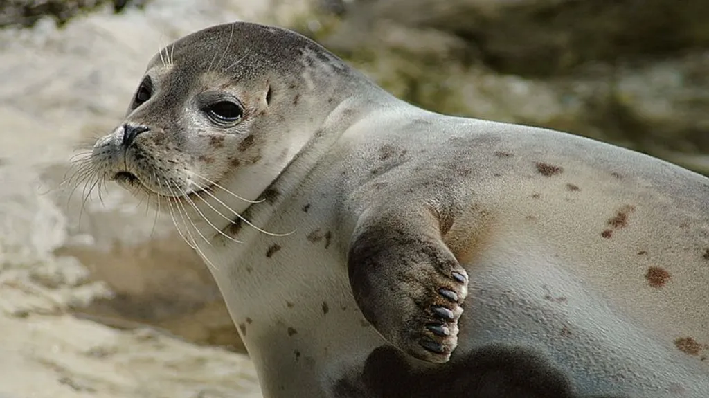

# Svět tuleňů - Kompletní atlas a zajímavosti

## Úvod
**Název projektu:** Svět tuleňů online
**Autor:** Adéla Pazderová  
**Popis tématu:** Tento projekt slouží jako komplexní informační a zoologický portál věnovaný čeledi tuleňovitých (*Phocidae*). Cílem projektu je poskytnout detailní přehled o anatomických adaptacích, fyziologii a chování těchto mořských savců, doplněný o interaktivní atlas všech 17 žijících druhů. Web je navržen s důrazem na špičkový výkon, moderní sémantiku, plnou přístupnost (accessibility) a responzivitu, která eliminuje neestetické deformace prvků na mobilních zařízeních.

**Živý web (GitHub Pages):** [https://adela3tulen.github.io/seal_web_Adela_Pazderova/](https://adela3tulen.github.io/seal_web_Adela_Pazderova/)

---

## Použité technologie
* **HTML5:** Sémantické tagy, validní struktura podle standardů W3C.
* **CSS3:** Flexibilní layouty, CSS proměnné (Custom Properties), pokročilé Media Queries pro mobilní optimalizaci.
* **JavaScript (ES6):** Interaktivní klientské filtrování bez nutnosti znovunačítání stránky, správa stavu tmavého režimu (LocalStorage).
* **IDE:** Visual Studio Code (v1.85+)
* **Nástroje pro audit:** Google Lighthouse (Chrome DevTools) pro validaci přístupnosti a výkonu.

---

## Adresářová struktura
```text
seal_web_Adela_Pazderova/
├── 📄 index.html        (Hlavní HTML kód stránky)
├── 📄 style.css         (Čistý CSS kód pro vzhled a responzivitu)
├── 📄 script.js        (Čistý JavaScript pro přepínání režimů a filtry)
├── 📄 README.md         (Dokumentace s návodem)
├── 📄 robots.txt        (Instrukce pro vyhledávače, co mohou indexovat)
├── 📄 sitemap.xml       (Mapa webu pro vyhledávače)
└── tuleni/               # Adresář s optimalizovanými obrazovými materiály
    ├── tulen-obecny.webp
    ├── tulen-gronsky.jpg
    ├── tulen-krouzkovany.webp
    ├── tulen-vousaty.jpg
    ├── tulen-kuzelozubi.jpg
    ├── tulen-paskovany.jpg
    ├── rypous-sloni.jpg
    ├── tulen-pacificky.jpg
    ├── rypous-sloni.webp
    ├── tulen-leopardi.jpeg
    ├── tulen-krabozravy.jpg
    ├── tulen-weddelluv.jpg
    ├── tulen-rossuv.jpg
    ├── tulen-bajkalsky.webp
    ├── tulen-kaspicky.jpg
    ├── tulen-stredomorsky.webp
    └── tulen-havajsky.jpg
```
### Výkon (Performance)
Teoretický popis řešení: Optimalizace výkonu na straně klienta spočívá v redukci přenášených dat a efektivním plánování síťových požadavků. Pro snížení hodnot LCP (Largest Contentful Paint) a CLS (Cumulative Layout Shift) využíváme moderní úsporné formáty obrázků (.webp), nativní odložené načítání (Lazy Loading) a striktní definici rozměrů přímo v HTML kódu.

Výstřižek kódu:

```HTML
<div class="card-visual-img">
    
</div>
```
Vysvětlení: Atribut loading="lazy" zajišťuje, že prohlížeč stahuje obrázek až ve chvíli, kdy se k němu uživatel při posouvání stránky přiblíží. Atributy width="320" a height="220" definují přesný poměr stran. Prohlížeč tak pro fotku rezervuje místo předem a text po načtení obrázku "neodskočí" dolů.

### SEO
* **Teoretický popis řešení:** Moderní vyhledávače hodnotí weby na základě sémantické čistoty kódu a přítomnosti strukturovaných dat. Namísto generických divů jsou použity specifické HTML5 značky. Pro vyhledávací roboty jsou navíc implementována strukturovaná data ve formátu JSON-LD (Schema.org), která umožňují zařadit web do bohatých výsledků vyhledávání (*Rich Snippets*).
* **Výstřižek kódu:**

```html
<script type="application/ld+json">
{
  "@context": "https://schema.org",
  "@type": "WebSite",
  "name": "Svět tuleňů",
  "url": "https://adela3tulen.github.io/seal_web_Adela_Pazderova/"
}
</script>
```
### Přístupnost
Výstřižek kódu:

```HTML
filterButtons.forEach(b => {
    b.classList.remove('active');
    b.setAttribute('aria-pressed', 'false'); 
});
btn.classList.add('active');
btn.setAttribute('aria-pressed', 'true');
```
Vysvětlení: Návrh plně reflektuje standardy WCAG 2.1. Barevný kontrast textu vůči pozadí dosahuje vysokého poměru ve světlém i tmavém režimu. Web je plně ovladatelný vestavěnou klávesnicí (logický pohyb pomocí Tab, vizuální focus stavy). Pro asistivní technologie (čtečky obrazovky) jsou tlačítka filtru osazena dynamickým atributem aria-pressed, který okamžitě oznamuje stav filtru.

### Sociální sítě (Social Snippets)
Teoretický popis řešení: Při sdílení odkazu na sociálních sítích platformy vyhledávají specifické metaznačky v záhlaví webu. Tyto protokoly promění prostý textový odkaz na vizuálně atraktivní náhledovou kartu s obrázkem a popiskem. K tomuto účelu slouží Open Graph protokol a specifikace X Cards.

Výstřižek kódu:

```HTML
<meta property="og:type" content="website">
<meta property="og:title" content="Svět tuleňů - Kompletní atlas a biologie">
<meta property="og:image" content="tuleni/tulen-obecny.webp">
<meta name="twitter:card" content="summary_large_image">
```
Vysvětlení: Značky og:title a og:image určují přesný nadpis a hlavní obrázek, který se automaticky vykreslí v příspěvku na Facebooku nebo LinkedInu. Pravidlo twitter:card s hodnotou summary_large_image vygeneruje na síti X moderní zobrazení s velkým obrázkem.

### UI/UX a Responzivní design
Teoretický popis řešení: Správná vizuální hierarchie vyžaduje, aby se web přizpůsobil velikosti displeje. Na úzkých obrazovkách mobilních telefonů způsobuje fixní velikost písma a velké okraje vertikální deformaci a přetékání obrázků. Řešením je responzivní typografie postavená na změně velikosti kořenového písma (html) za použití relativních jednotek rem v kombinaci s flexibilním gridem.

Výstřižek kódu:

```CSS
@media (max-width: 768px) {
    html { font-size: 14px; }
    .grid-atlas { grid-template-columns: 1fr; }
    .card-visual-img img {
        width: 100% !important;
        max-width: 100%;
    }
}
```
Vysvětlení: Uvnitř Media Query pro mobily jsme snížili základní font na 14px, čímž se automaticky zmenšily texty definované v rem. Grid se přeskládal do jednoho sloupce (1fr), takže karty mají přirozenou výšku. Pravidlo width: 100% !important striktně drží obrázky uvnitř bílého pozadí karet a zabraňuje jejich přetékání do stran.

### AI Integrace
Teoretický popis řešení: Vývoj moderních webových rozhraní efektivně využívá umělou inteligenci jako partnera pro refaktorizaci kódu, generování sémantických textů na základě reálných biologických dat a pro odhalování skrytých chyb v responzivitě (tzv. layout overflow).

Ukázka promptu z vývoje:

„Obrázky v mé gridové struktuře atlasu na mobilu přetékají mimo bílé pozadí karet a texty se vertikálně natahují do dlouhých nudlí. Navrhni čisté řešení pomocí CSS proměnných, jednotek rem a object-fit pro reset mobilního zobrazení.“

Vysvětlení: Integrace AI spočívala v aktivním code-review. Na základě výše uvedeného promptu umělá inteligence odhalila nevhodné chování pevných šířek na mobilních zařízeních a vygenerovala čistý responzivní CSS kód, který sjednotil vzhled celého webu bez nutnosti nasazování těžkých JavaScriptových knihoven.

### robots.txt

```
User-agent: *
Allow: /

Sitemap: https://adela3tulen.github.io/seal_web_Adela_Pazderova/sitemap.xml
```

### sitemap.xml

```
<?xml version="1.0" encoding="UTF-8"?>
<urlset xmlns="http://www.sitemaps.org/schemas/sitemap/0.9">
  <url>
    <loc>https://adela3tulen.github.io/seal_web_Adela_Pazderova/</loc>
    <lastmod>2026-06-09</lastmod>
    <changefreq>monthly</changefreq>
    <priority>1.0</priority>
  </url>
</urlset>
```
